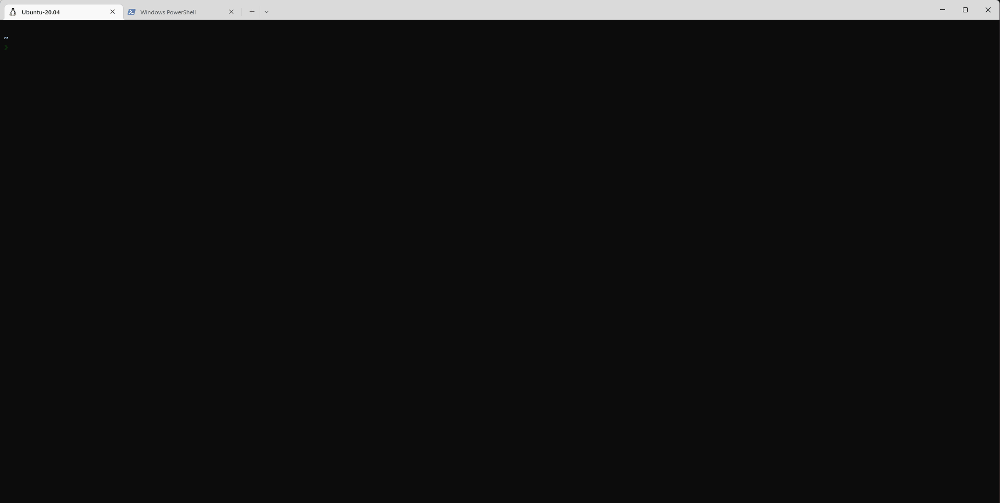

# windows-debug
krew plugin for launching a Windows host process pod that will give you access to the specified Windows node.



To use this plugin you will need:
      - kubernetes 1.22+ (with the [WindowsHostProcessContainers](https://kubernetes.io/docs/tasks/configure-pod-container/create-hostprocess-pod/) feature-gate enabled)
      - containerd 1.6+ as the runtime

## Usage

```bash
krew install windows-debug
kubectl windows-debug <node-name>
```

## Host process pods with debug tools

The command uses an image with some basic debugging tools, like vim.  

It is also built using the host process scratch image which contains nothing but the tools required.  This minimizes download times since you don't need to download nanoserver or windows server core images which are large and the binaries are not used in host process pods.

The scratch image has a limitation that it can only be built with buildx.  Buildx cannot be used to install the tools since it doesn't support `RUN` commands for Windows.  To work around this, the installer image is built on windows and used a cache.  The final image copies the files from the cache to the scratch image.

## Using a custom image
If you don't want the extra tools or you have custom tools you want installed you can specify a custom image:

```bash
kubectl windows-debug <node-name> --image <image-name>
```

## Releasing

### Images

Modify the images in `images` folder and them to main branch.

The run:

```bash
git checkout main
git tag image-v<nextversion>
git push --tags
```

### plugin

Update the default image in [kubectl-windows-debug](/kubectl-windows-debug).

Create a new release (Release is managed [krew release bot](https://github.com/rajatjindal/krew-release-bot)).

```bash
git checkout main
git tag v<nextversion>
git push --tags
```

The automation will create a github release and open a PR in https://github.com/kubernetes-sigs/krew-index. As long as only the version is changed, the PR will be automatically merged.

## test plugin locally

```bash
# generate manifest
docker run -v $(pwd)/.krew.yaml:/tmp/template-file.yaml rajatjindal/krew-release-bot:v0.0.43 krew-release-bot template --tag <github-tag> --template-file /tmp/template-file.yaml > manifest.yaml


# install local package
curl -LO <release-package-url>/kubectl-windows-debug-<tag0-version>.tar.gz
kubectl krew install --manifest=manifest.yaml  --archive=kubectl-windows-debug-latest.tar.gz
```

See the following for details:

- https://krew.sigs.k8s.io/docs/developer-guide/testing-locally/
- https://github.com/rajatjindal/krew-release-bot#testing-the-template-file

## Use as standalone without plugin

You don't have to install this as a plugin via krew.  You can also download and invoke the tool directly:

```bash
./kubectl-windows-debug <node-name>
```